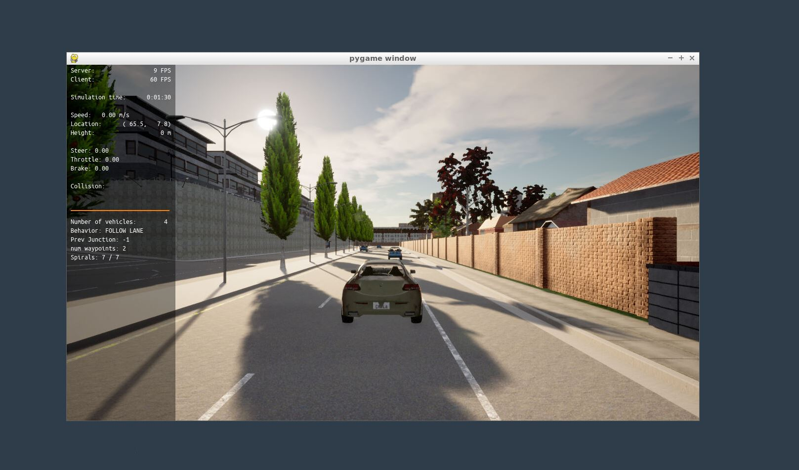
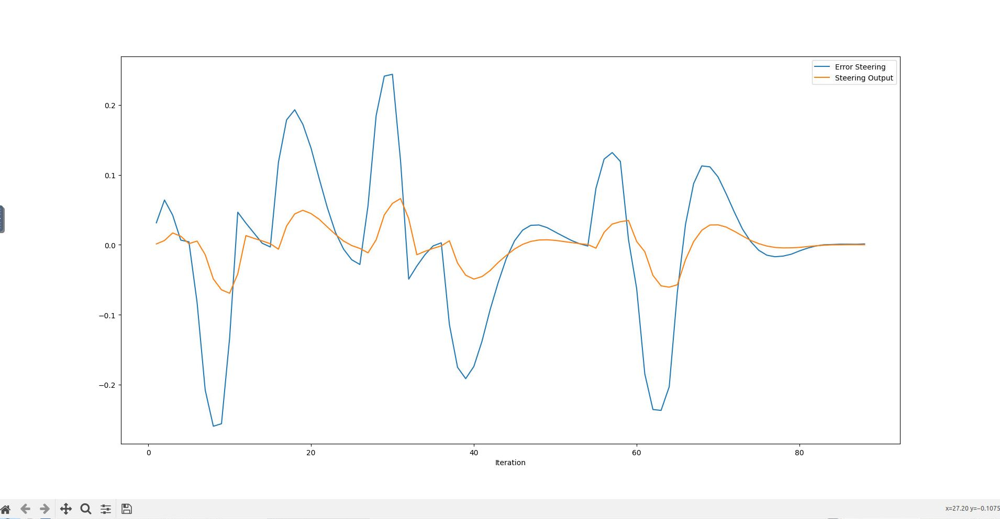
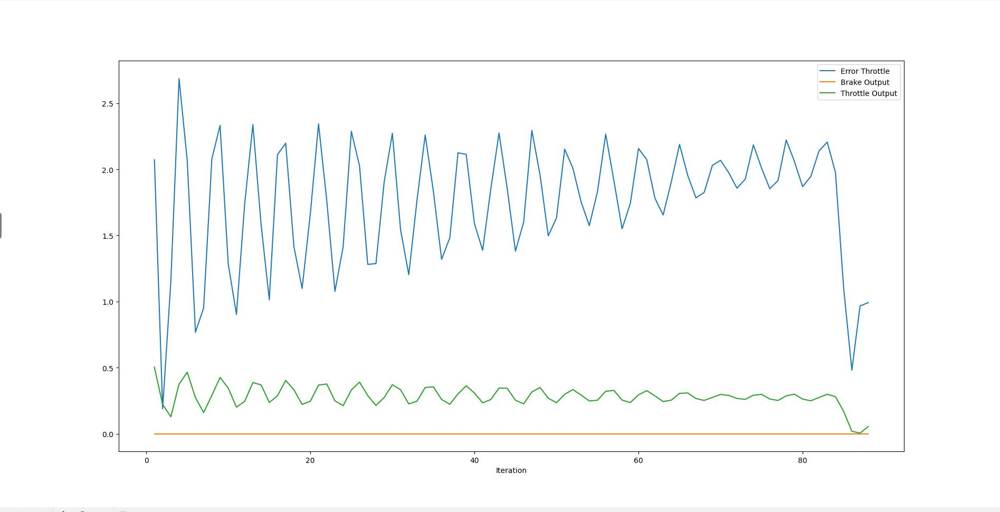

# Setup Carla Simulator

# How to Run the Code

# Resluting Plots 

# Provided Questions

## Q1
// Add the plots to your report and explain them (describe what you see)
The throttle_error_plot shows the output of the brake control signal and the throttle control signal. The error of the desired velocity and the
actual velocity is also display as error throttle.
The steering error plot shows the control output of the steering pid controller and the error between the x y waypoint coordiantes and the actual coordinates. 
## Q2
// What is the effect of the PID according to the plots, how each part of the PID affects the control command?
The PID controller keeps oszillating
## Q3
// How would you design a way to automatically tune the PID parameters?
Using the Twiggle algorithm from Sebastian's class.
## Q4
// PID controller is a model free controller, i.e. it does not use a model of the car. Could you explain the pros and cons of this type of controller?
Pros:
-no need to find a suitable model
-can be applied/transfered to different vehicles with different models
-robust tuning mechanisms available (Twiggle algo or Ziegler–Nichols method)
-only the errors needs to be measured
Cons:
-not suitable for complex systems
-does not account for non-linearity
## Q5
// (Optional) What would you do to improve the PID controller?
